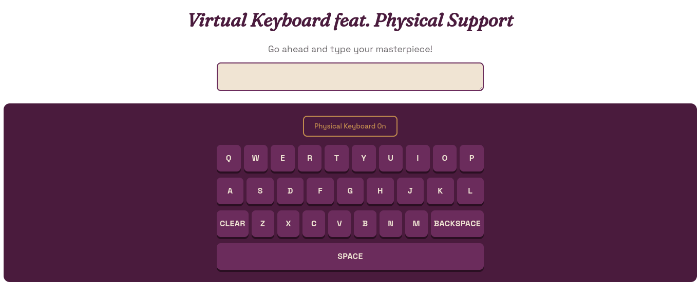

```markdown
# React Virtual Keyboard

An interactive virtual keyboard built with React that supports both mouse input and optional physical keyboard input. The project demonstrates reusable component design, React Hooks, controlled components, and global keyboard event handling.

---

## Project Background

This project began as the on-screen keyboard component for a collaborative Wordle-style game during a Chingu Voyage. After the project ended, I revisited the component and rebuilt it as a standalone application to improve its architecture, usability, and reusability.

Rather than leaving it tied to a single game, I redesigned it as a reusable React component capable of handling text input for a variety of applications.

---

## Screenshot


---

## Features

- Interactive on-screen keyboard
- Optional physical keyboard support
- Controlled textarea for synchronized text input
- Dynamic keyboard layout rendered from arrays
- React Hooks (`useState`, `useEffect`)
- Global keyboard event listeners with proper cleanup
- Responsive layout
- Clear, Backspace, and Space key functionality

---

## Built With

- React
- JavaScript (ES6+)
- JSX
- CSS3
- Vite
- npm

---

## React Concepts Demonstrated

- State management with `useState`
- Side effects and cleanup with `useEffect`
- Parent-to-child communication through props
- Child-to-parent communication with callback props
- Controlled components
- Conditional rendering
- Dynamic rendering using arrays and `.map()`
- Event handling for mouse and keyboard interactions
- Component composition and separation of concerns

---

## What I Learned

Building Version 2.0 taught me that improving a project often means improving its architecture rather than simply adding features.

During this refactor I practiced:

- Separating application state from presentation components
- Designing reusable React components
- Managing physical keyboard events alongside UI interactions
- Refactoring existing code while preserving functionality
- Thinking about scalability, maintainability, and user experience

---

## Future Improvements

- Visual key highlighting for physical and virtual keyboard input
- Additional keyboard layouts (numeric, gaming, international)
- Improved keyboard accessibility and focus management
- Custom themes
- Configurable keyboard layouts through props
- Extract physical keyboard logic into a reusable custom Hook

---

## Resources

- React Props & Callback Props  
  https://medium.com/@luwen900131/react-props-and-callback-prop-23a8c5134b6b

- Removing the Last Character from a String in JavaScript  
  https://tajammalmaqbool.com/blogs/javascript-remove-last-character

- Common Git Commit Message Prefixes  
  https://jabaltorres.com/blog/common-git-message-prefixes
```
